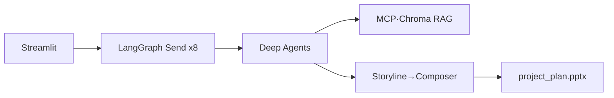

# AutoPM 해커톤 제출서 (간략)

---

## 회사 / 부서 / 이름

| 회사 | 부서 | 이름 |
| --- | --- | --- |
| _(기입)_ | _(기입)_ | _(기입)_ |

---

## 프로젝트 최종 도식 (Excalidraw)

- PNG: `docs/hackathon_architecture.png` → Excalidraw에 삽입
- 또는 아래 Mermaid를 [excalidraw.com](https://excalidraw.com)에 붙여넣기



---

## 프로젝트 제목

**AutoPM — 업무 아이디어를 발표용 추진계획서 PPT로 자동 생성하는 Multi-Agent PM**

---

## 해결하고자 한 Pain Point

- 발표·승인에는 **PPT(표·프로세스·KPI)** 가 필요한데, 수작업 작성에 시간이 많이 듦
- AS-IS/TO-BE, WBS, 예산, 리스크를 **한 사람이 일관되게** 쓰기 어려움
- 제목만으로는 맥락 부족 → **주제 → 추천 방향** 선택 UX로 보완

**데모:** ERP 월마감 데이터 검증 자동화 (월 40시간 수작업 → 자동 검증)

---

## 현재 구현된 정도

- Streamlit UI (주제·방향·진행·산출물·다운로드) ✅
- LangGraph 8단계 + Deep Agents + Sub-Agent·대화 ✅
- Chroma RAG(추진계획서 가이드 21문서) ✅
- MCP(AutoPM stdio + Presenton) ✅
- PPT 11장+ (Presenton → python-pptx 폴백) ✅
- API 없이 Demo fallback ✅

---

## 사용한 에이전트 프레임워크

| | 역할 |
| --- | --- |
| **LangGraph** | Orchestrator–Worker, `Send()`로 8 Core PM 단계 분배 |
| **Deep Agents SDK** | `create_deep_agent`로 단계별 실행·MCP·Sub-Agent |

→ **LangGraph = 흐름 제어, Deep Agent = 단계 실행** (하이브리드)

---

## 유저 쿼리문

```
ERP 월마감 데이터 검증 자동화
```

(또는 주제 1줄 + 추천 방향 카드 선택 후 생성)

---

## 사용한 Tools 소개

- **RAG:** `rag_search`, `retrieve_reference_context`, `proposal_tools`(S01~S10)
- **분석:** `extract_proposal_info`, `generate_interview_questions`, `estimate_cost`, `fp_estimate`
- **시각:** `mermaid_process`, `gantt_outline`, `read_slide_plan`
- **PPT:** `ppt_composer`, `layout_engine`, `presenton_export`

---

## 사용한 MCPs 소개

1. **AutoPM MCP** — RAG, 비용·FP, Mermaid, slide_plan
2. **Presenton MCP** (`localhost:5000/mcp`) — 고품질 PPTX 생성

---

## 사용한 Skills 소개

- Cursor Skill 파일: 미사용
- **AGENTS.md**, **agents.yaml / tasks.yaml / subagents.yaml** — Agent·System prompt 정의 ✅
- Evaluation Harness — 품질 점검 ✅

---

## 중간 노드들 결과값

- 8 Core PM: `agent_outputs` (요구사항·AS-IS·TO-BE·범위·WBS·예산·리스크)
- Sub-Agent: `subagent_outputs.json`
- 대화: `agent_dialogue.json`
- PPT 설계: `slide_storyline_raw`, `visualization_raw`, `presentation_graphics_raw`
- RAG: `rag_snippet`, `business_plan.json`

---

## 최종 노드 결과값

| 산출물 | 설명 |
| --- | --- |
| **`outputs/project_plan.pptx`** | 최종 PPT (핵심) |
| `slide_plan.json`, `project_plan.md` | 슬라이드 스펙·Markdown |
| `wbs.csv`, `budget.csv`, `risk_log.csv` | 표 데이터 |
| `evaluation_report.md` | 품질 평가 |

---

## 작동 과정 캡쳐 or 동영상

| ☐ | 내용 |
| --- | --- |
| 1 | 주제 입력 + 추천 방향 |
| 2 | Agent Progress 진행 |
| 3 | PPT 다운로드 + 슬라이드(AS-IS/WBS/리스크) |
| (선택) | 2~3분 데모 영상 |

_(스크린샷·영상 첨부)_ 

---

## 이 외 사항 — 사용 여부

| 항목 | 사용 |
| --- | --- |
| AGENTS.md | ✅ |
| System prompt (YAML) | ✅ |
| Supervisor / Critic Gate | ✅ |
| Demo fallback | ✅ |
| Middleware (별도) | ❌ |

---

## 앞으로의 고도화 계획

- 사내 PDF·과거 추진계획서 RAG 자동 적재
- 조직 PPT 템플릿 · Presenton 상시 연동
- ERP/Confluence MCP, 승인 워크플로

---

## 예상 파급효과

- 추진계획서·PPT 초안 작성 **40~60% 시간 절감(예상)**
- 표준 가이드 RAG로 **섹션 누락·가정 표기** 일관화
- Multi-Agent 패턴을 **다른 업무 기획**으로 확장 가능

---

## 실행

```powershell
streamlit run app.py
# 검증: $env:PYTHONPATH="src"; python scripts/verify_run.py
```
